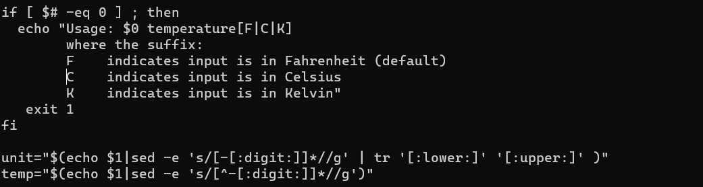

# Exam_2420
Brandon Woo, A01229117

## Part 1
- To update all of your software on your OS you can run the two commands in order
```
sudo apt update
sudo apt upgrade
```

## Part 2
- First step was to replace the 1 to a 0 in the if statement. I used `:s/1/0/g` to do this since the command replaces all instances of '1'

- second step was to fix the 'eco' typo to 'echo' to do this i used: `:%s/eco/echo/g` to fix all instances

- Third step was to change 'numbs' to 'digit'. I used ':s/numbs/:digit:' to do this

- fourth step was to change the '[F|V|K]' to '[F|C|K]'. I using the command `:%s/|V|/|C|`

- fifth step was to change the remaining C to a V using `:%s/V/C`


- The final output looksl ike this:


## Part 3
- the `-b` option for journalctl will print logs for the current boot. I searched for `boot` until i found the option.

- the `-p` option for journalctl will have a priority of warning or more important just use `-p warning`. I searched for `warning` and found this

- the `--ouput=json` will put the output in a json file. I searched for json with `/json` then scrolled up to see the option which was `--output`. I can use the json-pretty to make it nicer


- The command is:
```
sudo journalctl -b -p warning --output=json-pretty

```


## Part 4
```
#!/bin/bash

exec > /etc/motd # Sends the output to the motd file

# Get user info from the /etc/passwd file
USERS=$(grep '^[^:]\+:[^:]\+:[1-5][0-9][0-9][0-9]:' /etc/passwd)

# Print the info formatted correctly
echo "Regular Users on this system are:"
while read -r line; do
  # get just their username
  USERNAME=$(echo "$line" | cut -d ":" -f 1)
  # Get just their id
  USERID=$(echo "$line" | cut -d ":" -f 3)
  # Get just the shell they are in
  USERSHELL=$(echo "$line" | cut -d ":" -f 7) # The cut command removes the colon from the output

  echo "$USERNAME $USERID $USERSHELL"
done <<< "$USERS"

echo "" # Echo an empty line

LOGINUSERS=$(who | awk '{print $1}') # Get all users logged in
echo "Users currently logged in are:"
echo "${LOGINUSERS}"
```
- The file is stored in /opt/userlogs/

## Part 5

> Since i put type as oneshot, the service only ran once

- I put the service file in the `/etc/systemd/systemd` directory before daemon-reloading, starting, and enabling the service

- Here is the service file:
```
[Unit]
Description=Service file for the script to write information about users and users logged into the system

[Service]
Type=oneshot
ExecStart=/opt/userslog/userscript

[Install]
WantedBy=multi-user.target

```
## Part 6

- again placed in `/etc/systemd/system`
- here is the code:
```
[Unit]
Description=service timer for the userlogs script that will run 1 min after boot and again everyday while the unit is active

[Timer]
OnBootSec=1min
OnUnitActiveSec=24h

[Install]
WantedBy=timers.target

```
